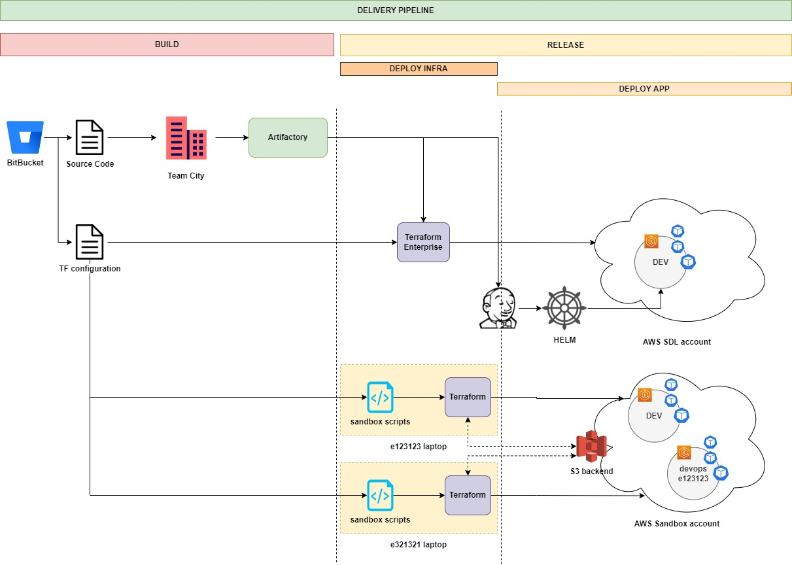

# Scripts for Sandbox zone

## Intro

These scripts are helping us to use the same TF configuration that we use for our SDL environment(s) (kept under DEV-AMBITFOCUS-AWS-SDL repo in corporate BitBucket) for our Sandbox environments as well.

If it was possible to have another workspace in Terraform enterprise that would be linked to the same BB repo, but initialized with different set of variable values, and able to execute against our sandbox AWS account - these scripts would not be required.

However, since sandbox account doesn't have any connectivity/integration to FIS tools (including TFE) this is not possible.

Scripts simply allow you to temporarily (for the duration of terraform action) modify this TF configuration in order for it to be applicable to specific sandbox environment. This is mostly due to the fact that in SDL environment TFE is configured as Terraform backend, and in Sandbox this role is performed by an S3 bucket.

## Delivery pipeline




## Directory structure

```yaml
tf
|---sandbox_deploy/
|                 |-.sandox_setup/
                  |               |-sandbox_backend.tf
                  |               |-sandbox_providers.tf
                  |               |-backend.conf_TMPL
                  |               |-base.tfvars_TMPL
                  |               `
                  |-bin/
                  |     |-create_sandbox_env.sh
                  |     |-sandbox_terraform.sh
                  |     |-cleanup.sh
                  |     |-list_envs.sh
                  |
                  |-sandbox_environments/
                                        |-us-east-1-focus-dev
                                        |                   |-backend.conf
                                        |                   |-base.tfvars
                                        |    
                                        |-us-east-1-focus-devops_e5658831
                                        |                    |-backend.conf
                                        |                    |-base.tfvars
```

## sandbox_terraform.sh

This script is a bash wraper around local terrafom binary. Apart from executing terraform it will do the following:

* temporarily mask (rename \*.tf to \*tf\_HIDE) SDL specific config files: \_backend.tf, _providers.tf and sdl.auto.tfvars
* temporarily introduce Sandbox specific config files: _sandbox_backend.tf and _sandbox_providers.tf
* execute terraform (plan, apply or destroy) with parameters supplied in backend.conf and base.tfvars in sandbox_environments/\<environment_name\>/
* unmask SDL specific config files
* remove Sandbox specific config files

### sandbox_terraform.sh usage

`./sandbox_terraform.sh <plan|apply|destroy> <sandbox_environment_dir_name>`

E.g.: sandbox terraform plan us-east-1-focus-dev

## cleanup.sh

This script can be used to reset the files to their original names in case sandbox_terraform.sh was interrupted and couldn't finish properly.

### cleanup.sh usage

`./cleanup.sh`

## create_sandbox_env.sh

This script can be used to create a directory for the new sandbox environment with appropriate base.tfvars and backend.conf files, so you can then edit your .tfvars and use:
`sandbox_terraform.sh plan <sandbox_environment_dir_name>`

IMPORTANT NOTES: 

* You need to make sure the environment you are about to create doesn't already exist in Sandbox account (make sure your environment name is unique)
* Destroy your sandbox environment as soon as you are done with it (it burns money...)

### create_sandbox_env.sh usage

`./create_sandbox_env.sh <region>-<application>-<environment>`

E.g.: ./create_sandbox_env.sh us-east-1-focus-devops_e5658831

The previous example would implicitly set the environment_type variable to 'devops_e5658831' and create a dedicated state file with the same name in S3 backend. This example also describes a possible syntax for environment name created for personal use by devOps engineers: 'devops_\<e-Number\>'

NOTE: Do not use '-' in application or environment name

## list_envs.sh

Just to list environment directories that can be used with sandbox_terraform.sh

NOTE: list does not necessarily reflect the real set of environments in Sandbox account. This is just a list of local directories under sandbox_environments/. 
### list_envs.sh usage

`./list_envs.sh`
